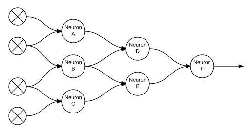
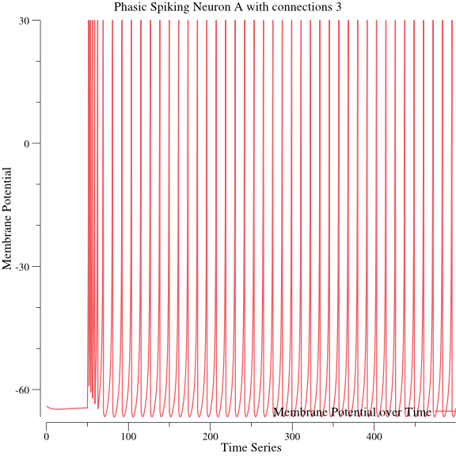
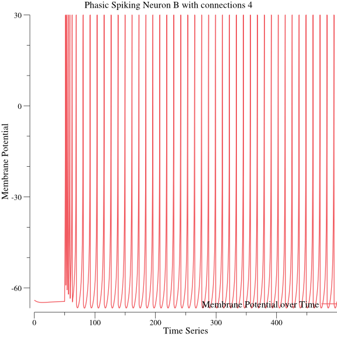
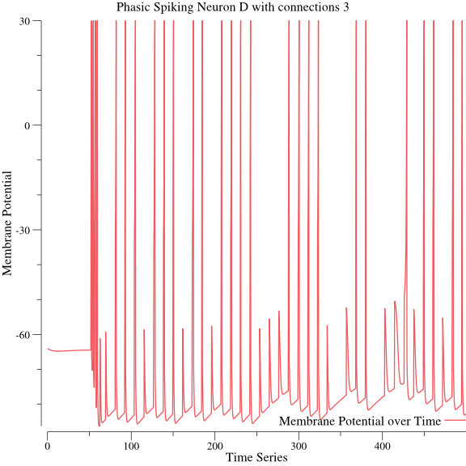
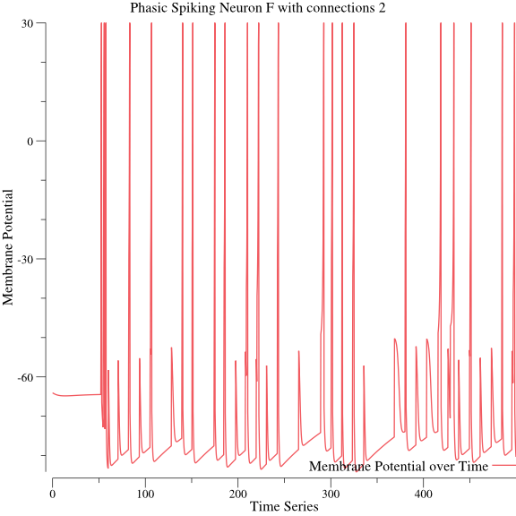

# Examples #
## Feed-Forward Simulation ##
Simple simulation of a Feed-Forward network.

With the following configuration, a network was simulated with a steady input _I_ of 15 from 4 external sources. Weights were the same throughout each connection.

Plots are shown for each neuron result

### Neuron A ###

### Neuron B ###

### Neuron C ###

### Neuron D ###

### Neuron E ###

### Neuron F ###

